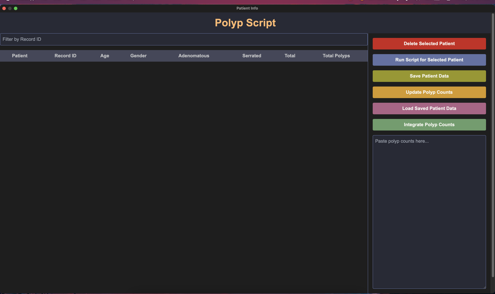
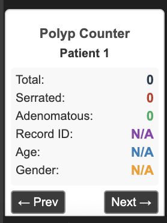
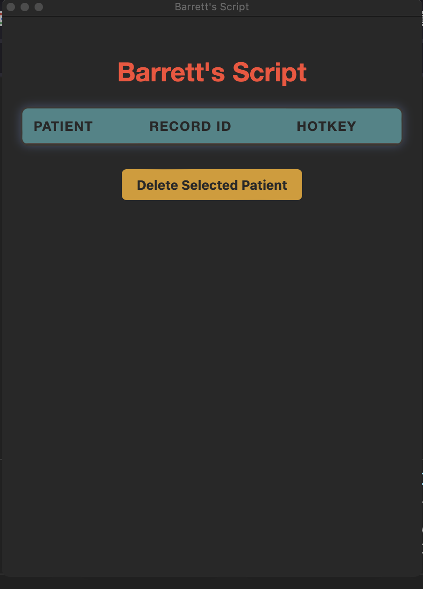

# Medical Data Automation Tool

# Data Automation Tool 

## Personal Initiative

This project was undertaken as a personal initiative, driven by my curiosity and passion for exploring the intersection of technology and healthcare. It has been in development for the past year, focusing on automating data extraction and entry for research purposes, improving efficiency and accuracy. 

## Disclaimer

Please note that this tool is not intended for public use. This upload is meant to show a proof of concept. The actual code used for my research may differ and has been utilized in a controlled environment to ensure compliance with data privacy and research protocols.

Applying this tool in a clinical setting or any other real-world environment requires appropriate ethical approval and compliance with patient data privacy regulations. Proper authorization is necessary before using or modifying this tool, especially when handling sensitive data.

**Note:** While this tool was tested and used in compliance with research protocols, any further application must adhere to ethical guidelines and institutional review board (IRB) requirements, ensuring the confidentiality and security of sensitive information.

## Key Features
- Automates data extraction and entry
- Implements data validation and duplicate checking
- Provides a user interface for easy data visualization and management
- Utilizes hotkeys for quick actions

## Technical Highlights
- Developed using Lua programming language
- Leverages Hammerspoon for macOS automation, with interaction through JavaScript
- Implements complex data structures and algorithms
- Includes error handling and data integrity checks
- Core code is customizable for various research studies and needs

## Core Components

The `init.lua` script serves as the central configuration file for the tool. It sets up the environment, initializes variables, and manages the activation of different automation scripts (`barrets`, `polyps`, and `polypjson`). Key functionalities include:

- Activating and deactivating scripts through the menu bar
- Emergency stop functionality to terminate all running scripts
- Error logging to track issues during script execution
- Binding hotkeys for quick access to different scripts

## Impact
- Increases efficiency and accuracy in medical record processing for research purposes
- Reduces the risk of data entry errors

## User Interface
Below are some screenshots of the tool in action:

### Polyp UI

### Polyp Counter UI

### Barrett's UI

